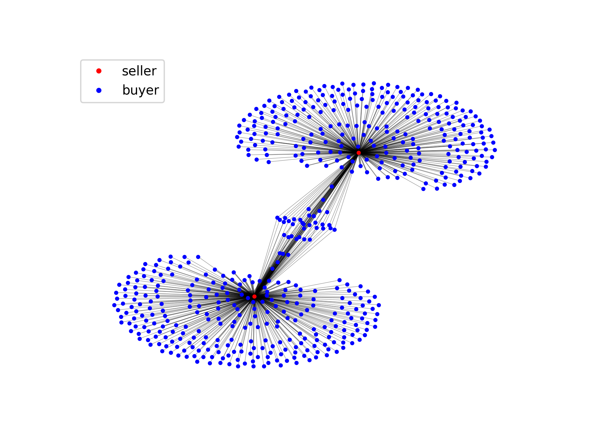

## Exploratory data and network analyses of a real-world sexual network

Performed exploratory data analysis of the collection of sexual contacts based on an online Brazilian escort community and then probed the resulting sexual network. The dataset is based on the paper of Rocha et al. [1]. There are 10106 unique buyers, 6624 unique sellers (escorts), and 50632 contacts that spanned from September 2002 to October 2008.

 

## Network snapshot of the top 2 nodes in terms of degree

## Questions?
If you have questions or clarifications in mind, please reach me at jprmaulion[at]gmail[dot]com. 🫶🏿

 

## Reference
[1] 1. Rocha, L. E. C., Liljeros, F. & Holme, P. Simulated Epidemics in an Empirical Spatiotemporal Network of 50,185 Sexual Contacts. PLoS Comput Biol 7, e1001109 (2011).
